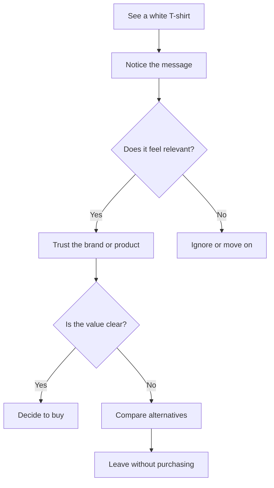

# Chapter 1: Persuasion and Human Decision-Making

Persuasion is not magic. It is a practical way of helping people notice something, interpret it in a useful way, trust it, and decide on a next step. In everyday life, persuasion shows up in a classroom, a product label, a political speech, a design pitch, and a store window. It is part of communication, not a separate trick that only “bad actors” use.

A plain-language definition of persuasion is this: persuasion is the process of shaping attention and understanding so that someone becomes more likely to consider, trust, or act on an idea or offer. It often depends on context, framing, timing, evidence, and relationship. Good persuasion helps people make informed choices. Bad persuasion pressures, deceives, or exploits them.

## Persuasion vs. Manipulation

Persuasion and manipulation are related, but they are not the same thing.

- Persuasion is transparent, respectful, and grounded in reasons. It tries to help a person understand value, risk, and trade-offs.
- Manipulation uses pressure, confusion, hidden motives, or emotional tricks to push a person toward a choice they might not have made with full awareness.
- Coercion is even more forceful: it uses threats, fear, or control to remove real choice.

A good designer does not simply “win” by overwhelming someone. A better goal is to make a decision clearer, not less free.

A simple way to think about it:

- Persuasion helps people see a reason.
- Manipulation hides the reason or distorts the decision.
- Coercion removes the choice altogether.

This matters because design is often an act of influence. A brand may choose color, typography, phrase, product description, or layout to steer attention. That is not automatically unethical. But it becomes ethically questionable when the design obscures facts, creates false urgency, or exploits someone’s fears or vulnerability.

## Why People Decide the Way They Do

People are not perfectly rational. We are constantly making decisions under time pressure, uncertainty, and emotion. That is why persuasion often works through small changes in framing rather than giant speeches. A person may buy a product because it feels credible, because peers are using it, because they fear missing out, or because the choice feels consistent with who they are.

A designer who understands this can help people feel informed instead of manipulated. That means presenting options clearly, giving honest information, and respecting the person’s ability to choose.

## Robert Cialdini’s Principles of Influence

Robert Cialdini, a social psychologist, identified several recurring patterns in how people respond to persuasive messages. These are not magical rules; they are patterns that can be used responsibly or irresponsibly.

### 1. Reciprocity

People tend to feel obliged to return a favor or gift.

Example: A free sample, a useful consultation, or a complimentary item can create goodwill. The person feels a subtle pull to repay the kindness.

Ethical use: Offer genuine value first. Misuse risk: Create debt-like pressure or guilt.

### 2. Scarcity

People place more value on things that seem limited, rare, or running out.

Example: “Only a few left” or “limited edition” can increase urgency.

Ethical use: Give honest supply information. Misuse risk: Fabricate urgency or fake scarcity.

### 3. Authority

People tend to trust perceived expertise or credentials.

Example: A product labeled with clear expertise, quality standards, or expert endorsement may feel more credible.

Ethical use: Share credentials and evidence. Misuse risk: Pretend expertise or use status to bypass scrutiny.

### 4. Consistency and Commitment

Once people commit to a position, they are more likely to follow through to stay consistent with themselves.

Example: A small public commitment can later shape a larger decision.

Ethical use: Ask people to commit to values they actually believe in. Misuse risk: Use tiny agreements to trap people into bigger choices later.

### 5. Liking

People are more likely to respond positively to people or brands they feel connected to, similar to, or fond of.

Example: Friendly tone, clear storytelling, and relatable design can build trust.

Ethical use: Build genuine rapport and clarity. Misuse risk: Use charm or flattery to bypass actual substance.

### 6. Social Proof

People look to what others do, especially in uncertain situations.

Example: Reviews, “best seller” labels, popular usage, or visible community activity can signal that a choice is safe and desirable.

Ethical use: Show real, relevant evidence. Misuse risk: Fake popularity or manipulate comparison.

## A Quick Comparison Table

| Principle | Mechanism | Ethical use | Misuse risk |
| --- | --- | --- | --- |
| Reciprocity | People feel obliged to return value received | Offer genuine help or samples without hidden pressure | Creating guilt or obligation that overwhelms choice |
| Scarcity | Limited availability increases perceived value | Use real inventory or time limits honestly | Inventing urgency or fear of missing out |
| Authority | People trust expertise and credentials | Show clear evidence, expertise, and transparency | Pretending to be expert or using status to dominate |
| Consistency | People want to act in line with earlier commitments | Encourage values-based steps and authentic decisions | Trapping people with small commitments that lead to larger ones |
| Liking | Familiarity and warmth create trust | Build authenticity, empathy, and relatable communication | Using charm, flattery, or emotional manipulation |
| Social proof | People copy what others do | Use real reviews, examples, and community signals | Fake popularity or misleading peer pressure |

## Beyond Cialdini: Other Useful Ideas

Cialdini gives a strong foundation, but persuasion is broader than six principles. Several other concepts help explain how people decide.

### Framing

Framing is how a message is presented. The same product can look different depending on the language around it.

A plain white T-shirt is still a plain white T-shirt. But a brand might describe it as:

- a “classic everyday essential”
- a “premium cotton uniform”
- a “limited-run artist collaboration”
- a “breathable, low-maintenance work shirt”

The object stays the same. The story changes. Framing influences attention and meaning without altering the physical product.

### Loss Aversion

People tend to feel the pain of losing something more strongly than the pleasure of gaining something similar.

Example: “You can still get this price today” often works better than “This is a good value” because the message emphasizes loss avoided. In design, this can help people act quickly, but it can also become manipulative when the “loss” is exaggerated or invented.

### Cognitive Ease

People prefer information that is easy to understand. Simplicity matters. If a product, interface, or message feels clear, familiar, and low-effort, trust often grows.

Example: A clean label with a clear benefit statement can outperform a crowded presentation. Designers often improve persuasion by reducing friction and confusion, not by adding more noise.

### Narrative and Meaning

Humans are story-driven. We do not only evaluate features; we also ask what this product says about us. A T-shirt may signal comfort, professionalism, rebellion, mindfulness, or identity. A persuasive design does not just describe a product. It suggests a story that fits a person’s self-image or aspiration.

This is why branding matters. Branding is not just decoration. It is a system for guiding interpretation.

## A White T-Shirt Example

A plain white T-shirt is a useful example because it is simple, familiar, and easy to frame in many ways.

A brand could sell the same shirt with three different perspectives:

1. Functional value: “A dependable cotton tee for daily wear. Soft, breathable, easy to style.”
2. Identity value: “Your everyday uniform. Clean, minimal, confident.”
3. Status or scarcity value: “A limited release from a small studio. Made in a short run.”

Notice that the shirt itself has not changed. The difference comes from tone, emphasis, context, and the implied story. One version speaks to utility. Another speaks to identity. Another speaks to exclusivity.

This is a key lesson for design: persuasion often works by shaping what people think the object means, not just what it is.

## A Simple Decision Journey

This simplified journey shows how persuasion works in stages: attention, interpretation, trust, and action. A designer who understands this can strengthen the decision path rather than force it.

## Questions to Ask Before Trying to Persuade

Before trying to influence someone, a thoughtful designer should pause and ask:

- What am I trying to help the person understand, versus what am I trying to hide?
- Is the message honest, or am I relying on confusion, fear, or pressure?
- Am I giving the person enough information to make a real decision?
- What assumptions am I making about their needs, values, or time constraints?
- Am I building trust or simply creating urgency?
- Would I be comfortable if the same argument were explained openly to the person I am trying to persuade?

Good persuasion should reduce uncertainty and make choices clearer. If it depends on manipulation, it usually fails in the long run and damages trust.

## Ethical Design and Responsible Influence

It is easy to glamorize persuasion as a clever tactic. But a design approach with ethics is more durable. Ethical persuasion:

- respects the reader as a person, not just an audience
- gives accurate information and meaningful context
- avoids pressure that prevents real choice
- uses evidence and clarity instead of fear or confusion
- recognizes that trust is a long-term asset

This matters because design is not only about selling. It is also about how people interpret the world. Persuasion becomes more meaningful when it supports informed decision-making rather than exploitation.

## Explore Further

If you want to go deeper, search for these topics:

- Cialdini principles of persuasion
- framing and decision-making in marketing
- loss aversion and behavioral economics
- social proof in product design
- ethical persuasion in branding and UX
- white T-shirt as a cultural design object

## What You Should Remember

Persuasion is not simply a technique for getting people to say yes. It is a way of shaping how people understand value, trust, and choice. The best persuasive design is honest, clear, and grounded in real needs.

The major lessons from this chapter are straightforward:

- Persuasion helps people see reasons and make decisions.
- Manipulation hides reasons or distorts the decision.
- Cialdini’s principles are useful tools, but they are not moral shortcuts.
- Framing, loss aversion, cognitive ease, and narrative all shape decisions.
- The same physical object can mean very different things depending on how it is framed.
- A designer should aim for trust, clarity, and informed choice, not pressure.

When persuasion is used responsibly, it can help people understand a product, a brand, or an idea in a more thoughtful way. That is not weakness. It is design with purpose.
