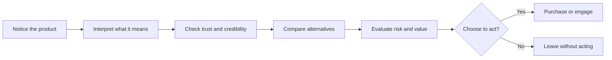

# Persuasion and Human Decision-Making

People often think persuasion is just a sales technique, but it is much broader than that. Persuasion is the process of shaping how someone notices a message, understands it, trusts it, and chooses to act. In design, branding, and communication, persuasion is not only about making people buy something. It is also about helping people see value, make sense of a choice, and feel confident in a decision.

A plain-language definition is this: persuasion is the effort to influence someone by giving reasons, framing meaning, and reducing uncertainty without forcing them to agree. It is part of everyday life: a teacher clarifies an idea, a designer makes a product feel useful, a friend recommends a restaurant, a campaign explains why a policy matters. In each case, persuasion is about attention, interpretation, trust, and action.

## Persuasion, Not Coercion, Not Manipulation

Persuasion should be distinguished from coercion and manipulation.

- Coercion uses pressure, threats, or force. A person is pushed into action against their real preference.
- Manipulation uses hidden motives, deception, or exploitation to steer a person away from informed choice.
- Persuasion uses honest information, relevant reasoning, and respect for the other person’s freedom to decide.

A good rule is simple: if the person can still evaluate the argument and choose freely, it is more like persuasion. If the choice is driven by fear, confusion, or hidden motives, it moves toward manipulation or coercion.

This matters because people are not blank slates. They already carry beliefs, habits, values, and emotional reactions. Persuasion works best when it acknowledges human reality rather than pretending people are purely rational machines. In other words, persuasion is not about tricking people; it is about helping them connect a message to what they already care about.

## Robert Cialdini's Principles of Influence

Robert Cialdini identified several patterns that help explain why people often say yes to certain requests. These principles are useful tools, but they are not automatically ethical. They become responsible when used to inform, not to exploit.

### 1. Reciprocity
People feel a duty to return favors or kindness. If someone gives us something first, we often feel more inclined to give something back.

Example: A brand offers a small free sample, and the buyer feels more comfortable purchasing the full product.

### 2. Commitment and Consistency
Once people commit to a choice or identity, they want their later actions to match it. This is why a person who says, “I care about quality,” may be more willing to pay more for a well-made product.

### 3. Social Proof
People look to others to decide what is normal, wise, or desirable. Reviews, testimonials, popularity, and crowd behavior can shape decisions.

Example: A product with many positive reviews seems safer than one with no visible evidence.

### 4. Authority
People tend to trust experts, institutions, credentials, and visible competence. Authority reduces uncertainty.

Example: A designer may trust a fabric recommendation from an experienced tailor more quickly than from a generic online ad.

### 5. Liking
People are more receptive to messages from people they find familiar, attractive, likable, or similar to themselves.

Example: A brand that feels friendly and relatable often gets more attention than one that feels cold and distant.

### 6. Scarcity
When something feels limited, rare, or time-sensitive, people often value it more. Scarcity creates urgency.

Example: A limited release of a jacket may feel more desirable than an ordinary item in stock all year.

## A Quick Comparison of Major Influence Principles

| Principle | Mechanism | Ethical use | Misuse risk |
| --- | --- | --- | --- |
| Reciprocity | People feel obliged to repay a benefit or gesture. | Offer real value, a sample, or useful information without pressure. | Creating guilt or obligation that manipulates choice. |
| Commitment and Consistency | People prefer choices that align with earlier commitments or identity. | Help people express values and follow through honestly. | Using public commitments or emotional pressure to force conformity. |
| Social Proof | People infer value from what others do or recommend. | Show genuine customer feedback and transparent evidence. | Fake testimonials, artificial hype, or social pressure. |
| Authority | Trust increases when expertise and credibility are visible. | Present credentials, process, and clarity honestly. | Pretending expertise or relying on status to overpower reasoning. |
| Liking | People respond more positively to familiar, attractive, or relatable communicators. | Build genuine rapport and shared values. | Exploiting personal affinity or flattery to bypass real evaluation. |
| Scarcity | Limited availability makes an option feel more valuable. | Use real inventory or time limits transparently. | Creating artificial urgency or fear of missing out. |

These principles are often useful because they describe what people are already doing. But they are not a moral license. A designer or marketer should ask whether a technique helps people decide well or simply pressures them into compliance.

## Other Useful Ideas from Psychology, Behavior, and Rhetoric

Persuasion is not limited to Cialdini. Several other ideas help explain why people decide the way they do.

### Framing
The same fact can be presented in different ways, and the framing changes how people interpret it. A person may see a shirt as “a basic essential” or as “a premium limited edition,” even though the product itself has not changed.

This is one of the most important lessons for designers: framing is not lying; it is selecting emphasis. But it can become deceptive when the emphasis hides important information.

### Loss Aversion
People tend to feel the pain of a loss more strongly than the pleasure of an equivalent gain. This makes urgency and the fear of missing out powerful, but it also means people may choose quickly without thinking deeply.

Example: “Only 15 left” can trigger a faster decision than “This is a good value.” In an ethical design process, urgency should be tied to real facts rather than manufactured panic.

### Ethos, Pathos, and Logos
Rhetoric gives us another useful lens. Persuasion often works by combining:

- Ethos: credibility and trust
- Pathos: emotion and connection
- Logos: logic and evidence

A persuasive message usually needs more than one of these. A product that only appeals to emotion may feel shallow; a message that is all logic may feel cold. Strong persuasion links reason, emotion, and trust.

## A Simple Decision Journey

A decision is rarely one moment. It usually moves through a series of small steps.

This flow reminds us that persuasion works at many stages. It starts with attention, then interpretation, then trust, then evaluation, then action. If a designer ignores any one step, the message may fail even if the product is good.

## The White T-Shirt Example

A plain white T-shirt is a useful case study because it is physically simple. The shirt itself does not change, but the story around it can.

### Option 1: The Basic Essential
The T-shirt is presented as a reliable everyday staple. The message focuses on comfort, simplicity, and practicality. This appeals to people who value utility and low-friction daily life.

### Option 2: The Premium Wardrobe Piece
The same shirt is framed as made from better cotton, with attention to fit and finish. The message stresses quality and self-image. This may appeal to people who want to feel curated, intentional, and elevated.

### Option 3: The Limited Release
The same shirt is presented as a rare, small-batch product. The message stresses scarcity and uniqueness. It appeals to people who value exclusivity and the fear of missing out.

### Option 4: The Ethical Choice
The product is described as organic cotton, fair labor, and transparent sourcing. This message speaks to values and identity. It may be persuasive to people who want their purchases to reflect their ethics.

The key point is this: the shirt does not become a different object. Only the framing changes. Persuasion is often less about inventing value than about choosing which value story to emphasize.

## Questions to Ask Before Trying to Persuade

Before trying to influence someone, a thoughtful designer should pause and ask:

- Who is this message for, and what do they actually care about?
- Am I making the decision easier, or am I trying to pressure the person into a choice?
- Am I sharing relevant facts, or am I hiding inconvenient information?
- What assumptions am I making about the audience’s values, status, or identity?
- Is this message honest enough that it would still be persuasive if the person had time to think carefully?
- What would happen if the person said no? Would I respect that response?

Persuasion is strongest when it respects the other person’s agency. If a message is built only on pressure, confusion, or fear, it is likely not a good design choice.

## Explore Further

If you want to deepen this topic, try searching for:

- Cialdini principles of influence explained
- framing effect in marketing and design
- loss aversion examples in everyday choices
- ethos pathos logos in advertising
- ethical persuasion vs manipulation in communication

## What You Should Remember

- Persuasion is the effort to shape attention, interpretation, trust, and action without forcing a person.
- It is not the same thing as manipulation or coercion, even though the line can be fuzzy in practice.
- Cialdini’s principles help explain common decision patterns, but they must be used responsibly.
- Framing, loss aversion, and rhetorical appeals are also important tools for communication.
- The same plain white T-shirt can carry different meanings depending on the story and values attached to it.
- Good persuasion helps people decide with clarity and freedom. Bad persuasion hides the truth, exploits vulnerability, or removes choice.

A persuasive design is not the loudest one. It is the one that helps people understand, trust, and decide well.
