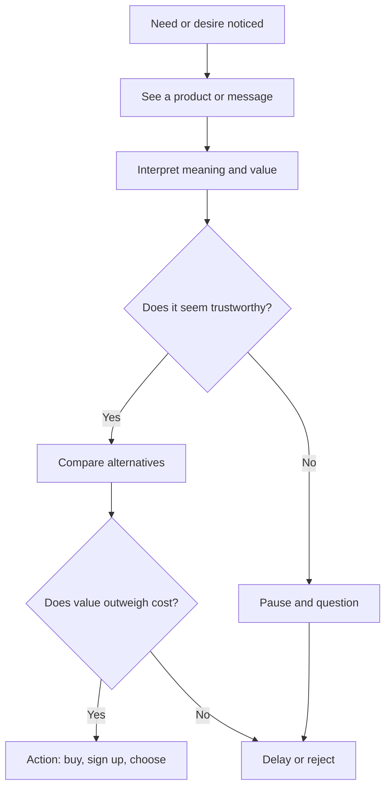

# Chapter 1 — Persuasion and Human Decision-Making

## What is persuasion?

Persuasion is the process of shaping how someone notices, interprets, trusts, and acts. It is not simply a sales tactic. It is part of everyday life: a teacher clarifies a difficult idea, a friend recommends a restaurant, a designer decides how a product looks and communicates value, a city explains why a public project matters. In each case, persuasion helps people make sense of information and choose a direction.

At its best, persuasion is a tool for clarity. It helps people see a reason, understand a tradeoff, and act with confidence. It is not about forcing a decision. It is about making the right decision easier to understand and more likely to feel legitimate.

## Persuasion is not the same as manipulation

Persuasion and manipulation are related, but they are not the same thing.

- Persuasion gives people reasons, context, and honest information so they can decide for themselves.
- Manipulation hides or distorts the real situation, exploits weaknesses, or pressures people into choices they would not make with full understanding.
- Coercion is even more direct: it uses threats, intimidation, or force.

A useful way to think about it is this: persuasion helps someone choose; manipulation tries to bypass their judgment; coercion removes their choice.

Good design often aims to help people understand value, not to trick them. A designer who knows the difference is more likely to create work that is effective, respectful, and durable.

## A simple framing example: the plain white T-shirt

Imagine a plain white T-shirt. The shirt itself does not change. It is still cotton, likely simple construction, and a familiar garment. But the same shirt can be framed in different ways:

- As a basic essential for everyday comfort.
- As a premium product made to last and feel better.
- As a symbol of minimalist style.
- As an item created by a small independent brand with a clear story.
- As a limited-run piece tied to a specific event or identity.

The physical object is the same. What changes is the meaning attached to it: the story, the evidence, the mood, the social signals. That is persuasion in action. Designers do not just shape objects; they shape interpretation.

## Robert Cialdini's major principles of influence

Psychologist Robert Cialdini described several recurring ways people are influenced. The most commonly taught principles are:

1. Reciprocity: people feel obligated to return favors or generosity.
2. Commitment and consistency: people prefer to act in ways that match what they previously said or did.
3. Social proof: people look to others, especially groups, to decide what is normal or wise.
4. Authority: people are more likely to trust experts, institutions, or credible sources.
5. Liking: people are more responsive to people they like, identify with, or find familiar.
6. Scarcity: people value things more when they seem limited, rare, or time-sensitive.

These are not tricks to be used randomly. They are patterns in human decision-making. When used thoughtfully, they can help people make better-informed choices. When used carelessly, they can create pressure, confusion, or exploitation.

## Other useful ideas from psychology and communication

Persuasion is broader than just a list of six principles. Two helpful ideas from related fields are especially useful for designers.

### 1. Framing and loss aversion

People do not evaluate all choices the same way. Framing changes how a decision feels. For example, saying a shirt is “$20 plus shipping” is different from saying “a limited offer at $20 saves you $10.” The same product can feel either practical or urgent depending on the wording.

Behavioral economics also shows that people are often more sensitive to losses than gains. The phrase “don’t miss out” is more motivating than “you could save money,” because the fear of losing something feels more immediate than the idea of gaining an advantage.

### 2. Narrative and meaning-making

People do not just react to features; they react to stories. A shirt can be described as “comfortable, versatile, and durable,” but it becomes more persuasive when it fits into a larger story: a product made for everyday life, a workwear staple, a clean and intentional wardrobe, a symbol of self-expression.

Rhetoric and communication research emphasize that people often decide based on coherence, emotion, and identity. If an idea fits their values, habits, and sense of self, it feels more credible. A strong message does not shout; it helps the audience see themselves in the offer.

### 3. Cognitive ease and clarity

People often choose what is easiest to understand. Complex language, cluttered visuals, and unclear benefits make decisions harder. Good persuasion reduces friction and uncertainty. It turns a vague feeling into a clear reason.

This matters for design. A product can be excellent and still fail if its value is hidden behind weak messaging, confusing layout, or mixed signals. Clearer choices tend to feel more trustworthy.

## Principle to mechanism to ethical use to misuse risk

| Principle | Mechanism | Ethical use | Misuse risk |
| --- | --- | --- | --- |
| Reciprocity | People feel a need to return a favor or gift. | Offer useful information, samples, or genuine value first. | Creating obligation through pressure or guilt. |
| Commitment and consistency | People prefer choices that align with their prior statements or actions. | Ask for small, voluntary commitments that support the user's goals. | Trapping people in choices they did not understand. |
| Social proof | People imitate what others are doing. | Show credible community feedback and real use cases. | Fake reviews, misleading popularity, or social pressure. |
| Authority | People trust expertise and recognized credentials. | Use expertise honestly and explain why it matters. | Pretending to be expert or using authority without substance. |
| Liking | People respond better to familiar, pleasant, relatable voices. | Build trust through warmth, clarity, and shared values. | Manipulating personal connection for profit or control. |
| Scarcity | Limited availability heightens perceived value. | Communicate real limits and time-sensitive realities honestly. | Inventing urgency or pressure to force action. |

The question is not whether these influences exist. They do. The real question is whether a design respects the audience's autonomy while still being persuasive.

## A simple decision journey

This basic journey helps explain why persuasion works: people rarely decide from a single fact. They move through attention, interpretation, trust, comparison, and final judgment.

## Why ethical persuasion matters

Ethical persuasion is not a contradiction. It is a discipline. It means being honest about what exists, clear about why it matters, and respectful of the audience's ability to decide.

A persuasive design should not hide important information. It should not exploit fear, confusion, or vulnerability. It should not turn a person into a target for manipulation. Instead, it should support informed choice.

The difference between ethical persuasion and manipulation often comes down to one question: are we helping people understand the choice, or are we trying to bypass their judgment?

## Questions to Ask Before Trying to Persuade

Before trying to influence someone, a designer should ask:

- What am I actually trying to change: attention, meaning, trust, or action?
- What evidence is honest and relevant?
- Am I making the choice clearer, or am I hiding important tradeoffs?
- Am I using urgency, authority, or fear in a way that respects the audience?
- Is this message true to the product and the user’s real needs?
- If the audience had more time and information, would this still feel fair?

Good persuasion does not need to pressure people. It needs to be clear, truthful, and respectful.

## White T-shirt example, continued

A white T-shirt is an easy product to reframe because it is familiar. Consider these messages:

- “A clean essential for everyday wear.”
- “Crafted for people who want less noise and more simplicity.”
- “Made in small batches for a more thoughtful wardrobe.”
- “The shirt that works with everything.”

Each statement highlights a different meaning without changing the shirt itself. The product remains the same, but the story changes. That is how persuasion works in design: it shapes context and meaning, not the physical object alone.

The same thinking applies to branding, packaging, advertising, and product design. The message is often the deciding factor, not technology, materials, or price alone.

## Explore Further

If you want to investigate this topic more, search for:

- “Robert Cialdini principles of influence explained”
- “framing effects behavioral economics”
- “loss aversion examples design and marketing”
- “persuasion vs manipulation ethics”
- “storytelling and persuasion in design”

Use these searches to compare explanations and test examples against your own judgment.

## What You Should Remember

- Persuasion is about shaping attention, interpretation, trust, and action.
- It is different from manipulation because it respects the audience’s ability to decide.
- Cialdini’s principles help explain common patterns of influence, but they should be used ethically.
- Framing, loss aversion, and narrative all shape how people judge a product or idea.
- Good design makes value clear and decisions easier without exploiting people.
- A plain white T-shirt can be sold as a staple, a statement, a luxury item, or a simple essential, depending on how it is framed.

The goal is not to pressure people into choices. The goal is to help them understand what matters and why.
