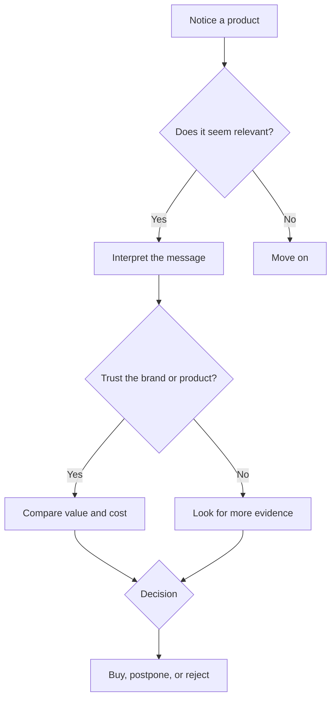

# Chapter 1 — Persuasion and Human Decision-Making

Persuasion is not magic, and it is not just salesmanship. At its simplest, persuasion is the process of shaping how someone notices, interprets, and responds to information so they can make a better-informed decision. In design and branding, that means helping people see value, understand meaning, and feel confident enough to act.

A designer does not simply make something look pretty. A designer often decides what a person notices first, what they think the object means, and what kind of action seems reasonable. Persuasion is a tool for organizing attention, building trust, and clarifying choices.

## Persuasion, Coercion, and Manipulation

Persuasion is different from coercion and manipulation.

- Coercion uses pressure, fear, or force. The decision is not truly free.
- Manipulation hides important information, exploits confusion, or tricks someone into acting against their interests.
- Persuasion, when used ethically, offers reasons, context, and clarity. It invites a person to weigh information and choose.

A good rule is this: persuasion should help people understand and decide; manipulation makes them act before they fully understand.

A plain white T-shirt is a useful example. The physical product is the same in every case. The difference lies in framing:

- A basic T-shirt can be described as a reliable everyday staple.
- It can be positioned as a premium item for minimalists.
- It can be sold as a versatile blank canvas for artists and makers.
- It can be marketed as an exclusive limited release.

The shirt does not change, but the meaning and value around it do. That is persuasion in action.

## Why People Do Not Always Decide Rationally

People are not perfectly logical decision-makers. We often rely on shortcuts, social cues, emotion, and context. That is not a flaw to be ashamed of; it is part of how human beings work.

When a person sees an unfamiliar product, they do not compare every possible option in a vacuum. They ask questions like:

- What does this seem like?
- Is it familiar?
- Do other people use it?
- Does it feel trustworthy?
- What might I lose by not choosing it?

Persuasion is most effective when it respects these realities instead of pretending people are purely rational.

## Robert Cialdini's Principles of Influence

One of the clearest introductions to persuasion comes from Robert Cialdini. His work describes several recurring patterns in human decision-making.

### 1. Reciprocity
People feel inclined to return a favor or repay a kindness. If someone gives something helpful, useful, or generous, the receiver may feel a social obligation to respond in kind.

Example: A brand gives a free guide, useful tip, or sample, then asks the customer to consider its product later.

### 2. Commitment and Consistency
People like to act in ways that match what they have already said or done. Once someone commits to a value, identity, or action, they tend to behave consistently with it.

Example: A customer says they care about quality and then chooses the product that feels aligned with that self-image.

### 3. Social Proof
People often look to others when unsure. If many people seem to prefer something, it can feel safer or more valid.

Example: Reviews, user counts, or popularity signals can reassure a hesitant buyer.

### 4. Liking
People are more open to influence from people they find familiar, friendly, or similar to themselves.

Example: A brand with a warm tone, clear values, and relatable storytelling can feel more trustworthy than a cold, distant one.

### 5. Authority
People tend to trust experts, credentials, and clear demonstrations of competence.

Example: A product presented by a knowledgeable maker or backed by visible expertise can feel more credible.

### 6. Scarcity
People react strongly when something is limited, rare, or time-sensitive. Scarcity creates urgency.

Example: A limited release, seasonal drop, or "only a few left" message can push decision-making forward.

These principles are not tricks in themselves. They are patterns in human behavior. The ethical question is not whether they exist, but how they are used.

## A Simple Decision Table

| Principle | Mechanism | Ethical use | Misuse risk |
| --- | --- | --- | --- |
| Reciprocity | People feel obliged to return favors or goodwill | Offer genuinely useful value before asking for action | Creating guilt or pressuring someone into a sale |
| Commitment and Consistency | People prefer choices that fit earlier beliefs or actions | Reinforce values and clear intentions | Tricking people into small commitments that lead to larger ones |
| Social Proof | People copy what others seem to do | Show real community feedback and shared experiences | Using fake ratings, exaggerated popularity, or fear-based comparison |
| Liking | People trust those they feel connected to | Build relatable, sincere, human communication | Manipulating emotion or exploiting personal vulnerability |
| Authority | People trust credible expertise | Demonstrate skill, transparency, and competence | Pretending expertise or using status without substance |
| Scarcity | People act faster when options feel limited | Communicate real limits and honest urgency | Fake countdowns, artificial shortages, or panic-based pressure |

## Other Useful Ideas from Psychology and Communication

Cialdini gives a powerful foundation, but persuasion also draws on other disciplines.

### Framing and Loss Aversion

People do not just evaluate what they gain; they also weigh what they might lose. This is often called loss aversion. We tend to react more strongly to the possibility of losing something than to the possibility of gaining something equivalent.

A white T-shirt can be framed in different ways:

- "This is a versatile, reliable everyday shirt." = gain-focused.
- "You will be missing out if you keep buying cheap substitutes that wear out." = loss-focused.

The product is the same, but the framing changes the emotional weight of the decision.

### Choice Architecture

The way options are organized shapes decisions. Designers and marketers do not just present products; they structure the decision environment. The order of choices, the language used, and the visible defaults matter.

A product page that shows a premium option first and the basic option second may steer attention. The choices are not necessarily unfair, but they are always influential. Good design should make the choice clearer, not more confusing or coercive.

### Narrative and Meaning

Humans remember stories more easily than isolated facts. A well-told explanation gives a product a frame of meaning. It tells people why the item matters.

For example, a white T-shirt may be presented as:

- a durable workhorse,
- a blank canvas,
- an understated symbol of simplicity,
- a luxury basic.

The shirt remains the same, but the story changes the audience's interpretation.

## A Simple Decision Journey

This diagram is intentionally simple. A person does not make a decision in one clean step. They notice, interpret, judge, compare, and then act or not act. Good persuasion works with that process rather than against it.

## The Ethical Question

Persuasion becomes ethically questionable when it hides the real tradeoffs, exploits insecurity, or removes a person's ability to make an informed choice.

A designer should ask not only, "Can this message influence people?" but also, "Is the message truthful, respectful, and fair?"

The goal is not to manipulate someone into a decision they did not understand. The goal is to make a good, honest case for a meaningful choice.

## Questions to Ask Before Trying to Persuade

Before asking someone to act, consider these questions:

- What am I really trying to change: attention, belief, or behavior?
- Am I offering clear information or using emotional pressure?
- Is my message honest about cost, tradeoffs, and limits?
- Am I appealing to a person's actual needs, or to insecurity and confusion?
- Would I be comfortable if the person asked me to explain my reasoning in plain language?
- Does the message respect the other person's intelligence and freedom to choose?

If the answer to those questions is weak, the persuasion may not be ethical or effective.

## White T-Shirt Example: Same Product, Different Framing

A plain white T-shirt is an ideal example because it is ordinary enough to be familiar and simple enough to bear different meanings.

### Option 1: The practical shirt
"This is a dependable, easy-to-style basic for everyday wear. It is clean, durable, and easy to pair with anything."

This framing emphasizes utility and simplicity.

### Option 2: The designer's shirt
"This is a blank canvas for self-expression. It is intentionally minimal, allowing the wearer to create their own aesthetic."

This framing emphasizes identity and creative freedom.

### Option 3: The premium shirt
"This is a carefully made garment meant to last. It is cut with better materials and stronger construction. It is an investment in quality rather than disposable fashion."

This framing uses quality, value, and longevity.

### Option 4: The limited-release shirt
"This run is intentionally small. It reflects a special moment, a unique design, and a narrow opportunity."

This framing relies on scarcity and exclusivity.

The physical shirt does not change. What changes is attention, meaning, and the emotional logic behind the purchase decision.

## Explore Further

If you want to continue the topic, good search terms include:

- Cialdini principles of influence
- loss aversion examples in marketing
- framing effects in decision-making
- choice architecture and behavioral design
- persuasion vs manipulation in design
- how narratives shape product meaning

## What You Should Remember

Persuasion is not the same as coercion, manipulation, or mind control. It is a way of helping people attend to what matters, interpret meaning, feel trust, and make a conscious choice.

The strongest persuasive work is usually honest, context-aware, and respectful. It recognizes that people are influenced by emotion, social cues, identity, and uncertainty, not just by reason alone.

A designer who understands persuasion is not simply trying to make people buy things. They are learning how attention works, how meaning is created, and how better choices can be made without treating people as if they are empty or easily fooled.
