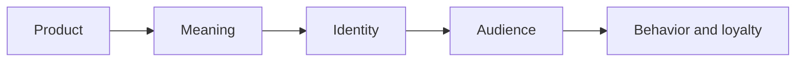

# Chapter 2 — Brand Archetypes and Meaning

A product is not just a product. It is also a story, a signal, and a promise. A brand does not simply sell a thing; it gives people a way to understand what that thing means and what kind of person it helps them become. This is where archetypes become useful.

Brand archetypes are familiar patterns of meaning drawn from myth, culture, and common storytelling traditions. They help explain why certain brands feel trustworthy, rebellious, luxurious, nurturing, or adventurous without needing a long explanation. In practice, archetypes are a way of giving a product an identity that people can recognize quickly.

## What Is an Archetype?

An archetype is a generalized pattern of meaning. It is a lens, not a literal personality test. A company or product can use one archetype as its dominant story while still containing other tendencies.

For example, a brand might be mostly Explorer in tone, but also include moments of Creator energy. A person is not one fixed personality trait, and a brand is not a single, sealed identity either. Archetypes are helpful because they organize how a brand communicates, but they are not rigid boxes.

Cultural context matters too. A symbol of authority, a story of rebellion, or a tone of simplicity may feel different across communities, generations, and industries. A strong brand understands that audience meanings can shift.

## Why Archetypes Matter for Design

People do not buy things only for function. They buy things because the product fits a story they want to tell about themselves. That story is often shaped by what they value most.

Ask this practical question:

"What does the audience get to feel, imagine, or become by choosing this brand?"

A plain white T-shirt can be a basic garment or a statement of identity. It depends on the frame around it.

The same shirt can mean different things:

- a tool for everyday certainty,
- a sign of creative freedom,
- a statement of status,
- a gesture of rebellion,
- a declaration of calm or care.

The shirt itself stays the same, but its meaning changes through the brand story and visual language around it.

## Common Archetypes

A useful set of common archetypes includes the following:

- Explorer: curiosity, freedom, movement, discovery
- Sage: wisdom, clarity, understanding, truth
- Creator: originality, expression, craft, imagination
- Ruler: control, quality, confidence, excellence
- Caregiver: protection, trust, warmth, support
- Rebel: disruption, independence, authenticity, edge
- Hero: courage, action, improvement, achievement
- Everyperson: accessibility, belonging, reliability, normal life
- Innocent: purity, optimism, ease, sincerity
- Jester: humor, play, joy, surprise
- Lover: intimacy, beauty, desire, connection
- Magician: transformation, wonder, vision, possibility

These are not the only archetypes, and they are not universal laws. They are useful shorthand for communicating identity and emotional meaning.

## A Comparison Table

| Archetype | Core feeling | Typical message | What the product means | Risk if overdone |
| --- | --- | --- | --- | --- |
| Explorer | Freedom and discovery | "Go where others have not gone" | The product enables movement and possibility | Feels chaotic or ungrounded |
| Sage | Clarity and insight | "Know better" | The product supports thoughtful decisions | Can feel distant or preachy |
| Creator | Originality and craft | "Make something new" | The product supports expression and experimentation | Can feel self-absorbed or impractical |
| Ruler | Confidence and control | "This is the standard" | The product suggests quality and authority | Can feel elitist or rigid |
| Caregiver | Trust and protection | "We take care of you" | The product creates safety and support | Can feel patronizing |
| Rebel | Independence and edge | "Break the pattern" | The product signals authenticity and resistance | Can feel aimless or anti-social |
| Hero | Action and achievement | "Take the next step" | The product rewards effort and progress | Can feel aggressive or performative |
| Everyperson | Belonging and ease | "This works for real life" | The product feels accessible and sincere | Can feel bland or generic |
| Innocent | Simplicity and optimism | "Keep it simple" | The product feels honest and calming | Can feel naive or overly cheerful |
| Jester | Play and delight | "Enjoy the moment" | The product brings humor and freshness | Can feel unserious or shallow |
| Lover | Beauty and connection | "Feel more deeply" | The product connects desire and identity | Can feel sentimental or overly seductive |
| Magician | Transformation and wonder | "Be changed" | The product promises a higher experience | Can feel grandiose or unreal |

## Same Product, Different Archetypes

A white T-shirt is especially good for showing how archetypes shift meaning because it is visually simple. The shirt itself is ordinary, but the right brand story can make it feel completely different.

### 1. Explorer — The shirt as freedom

A brand might present the shirt as built for movement, travel, and unplanned adventure. The copy could emphasize durability, comfort, and easy packing. The emotional promise is not that the shirt is luxurious. It is that it keeps up with a life in motion.

The audience feels: adaptable, free, outdoorsy, curious.

### 2. Creator — The shirt as a blank canvas

Another brand might treat the shirt as a platform for experimentation. It is minimal, open, and designed for print, layering, and personal expression. The emotional promise is that the wearer is not just buying a shirt; they are claiming creative control.

The audience feels: imaginative, artistic, expressive, original.

### 3. Ruler — The shirt as a standard of quality

A more premium brand may position the shirt as a carefully cut, well-made staple. It emphasizes fit, fabric, restraint, and quality. The shirt becomes a sign of taste and standards. It does not shout; it signals control and judgment.

The audience feels: confident, discerning, elevated, composed.

### 4. Rebel — The shirt as a refusal of noise

A rebellious brand might sell the shirt as an intentional rejection of overdesigned fashion. It is plain on purpose. The message is that the wearer is not interested in trends, hype, or conformity. The shirt becomes a quiet act of independence.

The audience feels: authentic, independent, skeptical of excess, self-directed.

### 5. Caregiver — The shirt as comfort and trust

A different brand might focus on softness, practicality, and everyday care. The shirt is made to be lived in and relied on. It speaks to comfort, security, and the idea that people should not have to constantly think about what they are wearing.

The audience feels: grounded, cared for, secure, practical.

These are all the same physical t-shirt. The meaning changes because the identity attached to it changes.

## A Simple Brand Meaning Journey

This diagram is simple, but it explains a major design truth: a product is not only what it is; it is what it stands for. A person chooses a product because they want to align with a set of meanings and values. The product then becomes a way of inhabiting an identity.

## Archetypes Are Not Destiny

Archetypes are useful, but they can become limiting if treated as rigid categories. A brand may look like a Rebel on its website and still speak in a very Caregiver way in customer service. A person may identify strongly with one archetype while also showing signs of another in different contexts.

The important point is this: archetypes are tools for understanding patterns, not literal personality diagnoses. They help organize brand behavior, but they should not trap a company into pretending it is more one-dimensional than it really is.

A strong brand is not a cardboard cutout. It is a system of signals, stories, and decisions that can support a coherent identity without becoming artificial.

## Questions to Ask When Choosing an Archetype

Before choosing a brand archetype, ask these questions:

- What feeling do we want the product to create?
- What kind of person does the audience want to become by choosing this brand?
- Does the message reflect a real value, or only a fashionable pose?
- Is the archetype consistent across product, packaging, tone, and visuals?
- Could the archetype be misunderstood in another culture or context?
- Are we giving the audience a meaningful identity, or just a slogan?
- What would this brand look like if it were honest about its limits?

A good archetype is not just memorable. It is believable.

## Why This Matters for Design

Designers are not only arranging visual elements. They are shaping how people interpret value. Archetypes are one way of organizing that process. They help a brand become recognizable without overexplaining itself.

A visual system, a product name, a tone of voice, and a packaging choice all contribute to the emotional narrative a brand creates. The same product can become a symbol of freedom, authority, care, creativity, or rebellion depending on the narrative structure.

That is why design decisions are never neutral. They always carry meaning.

## What You Should Remember

Brand archetypes are a practical framework for understanding how products gain meaning. They help explain how identity is attached to objects and how audiences connect with brands emotionally.

The most useful archetypes are not rigid labels but storytelling patterns that help people grasp what a brand stands for. A product can serve many meanings at once, but a brand becomes memorable when it chooses a clear emotional direction and communicates it consistently.

The same plain white T-shirt can be sold as an object of adventure, creativity, luxury, authenticity, or comfort. The shirt stays the same, but the story around it gives it a different identity and a different audience.
