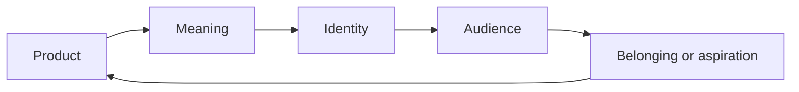

# Chapter 2 — Brand Archetypes and Meaning

## Why brands need meaning

A product is not just a product. It is also a story, a signal, and a promise. A plain white T-shirt can be a basic staple, a luxury statement, a working uniform, or a symbol of rebellion. The shirt itself stays the same, but the meaning attached to it changes.

This is where brand archetypes become useful. Archetypes are familiar patterns of meaning that people already understand from stories, culture, and daily life. They help brands give products a recognizable emotional shape.

When a brand chooses an archetype, it is not claiming that a person is only one personality type. It is choosing a direction for how the brand wants to be experienced. The right question is not, “What type of person is this brand?” but, “What does the audience get to feel, imagine, or become by choosing this brand?”

## What archetypes are

Archetypes are generalized cultural and narrative patterns. They are shorthand for ideas people already recognize: the hero, the caregiver, the rebel, the explorer, the creator, the ruler, and so on.

They are useful because they organize meaning quickly. A brand can say, “We stand for independence,” or “We stand for trust,” or “We stand for experimentation,” and people respond to those messages based on shared cultural understanding.

At the same time, archetypes are models, not literal personality diagnoses. A brand may contain multiple tendencies at once. A company might be practical and imaginative, rebellious and caring, serious and playful. A person is not reduced to a single label, and a brand should not be either. Cultural context matters too: a symbol or attitude that feels wise in one setting may feel dated or awkward in another.

Archetypes are tools for design and communication, not rigid boxes.

## Common brand archetypes

A practical set of archetypes often used in branding includes:

- Explorer: curiosity, freedom, discovery
- Sage: wisdom, learning, clarity
- Creator: originality, craft, imagination
- Ruler: control, quality, confidence
- Caregiver: support, safety, responsibility
- Rebel: disruption, authenticity, independence
- Hero: courage, action, achievement
- Everyperson: accessibility, honesty, relatability
- Innocent: optimism, simplicity, purity
- Jester: humor, joy, playfulness
- Lover: intimacy, beauty, connection
- Magician: transformation, possibility, vision

These are not the only archetypes, and different branding systems use slightly different names. The value is in the pattern: each archetype suggests a relationship between product, audience, and desired feeling.

## The same product, different meanings

The plain white T-shirt is a useful recurring example because it is simple enough to be interpreted in many ways.

### 1. The Explorer T-shirt

A shirt positioned as Explorer is about movement, independence, and lived experience. It might be described as:

- built for long days, road trips, and unexpected plans
- lightweight, flexible, and ready for the next place
- practical without looking rigid or over-designed

This shirt says: “You are not waiting for life to happen. You are going out and making your own path.”

### 2. The Sage T-shirt

A shirt positioned as Sage emphasizes calm, learning, and thoughtfulness. It might be described as:

- clean, timeless, and well considered
- designed for everyday clarity and intentional living
- a quiet kind of confidence rather than loud self-promotion

This shirt says: “The value is in what lasts, what makes sense, and what stands the test of time.”

### 3. The Rebel T-shirt

A shirt positioned as Rebel is less about comfort alone and more about attitude. It might be described as:

- deliberately unpolished and anti-formal
- a statement against overconsumption and trend-chasing
- made for people who want to look like themselves rather than fit a template

This shirt says: “Not everything needs to be approved. Sometimes the point is to break the pattern.”

### 4. The Creator T-shirt

A shirt positioned as Creator emphasizes originality, making, and experimentation. It might highlight:

- a blank canvas for expression
- a flexible piece that works with personal style
- an invitation to build, remix, and reinterpret everyday objects

This shirt says: “You are not just wearing clothing. You are making a personal statement.”

## Comparison table

| Archetype | Core feeling | Typical promise | Risk if used poorly |
| --- | --- | --- | --- |
| Explorer | Freedom, curiosity, movement | “Go, discover, live with intention.” | Feels vague or trend-driven without substance. |
| Sage | Wisdom, clarity, calm | “Make better decisions and live thoughtfully.” | Can feel distant, preachy, or overly serious. |
| Creator | Originality, craft, experimentation | “Make, remix, and express yourself.” | Can become self-consciously artistic or inaccessible. |
| Ruler | Confidence, order, quality | “This is dependable and worth trusting.” | Can feel controlling, elitist, or cold. |
| Caregiver | Safety, support, care | “This helps people feel looked after.” | Can become sentimental or paternalistic. |
| Rebel | Independence, challenge, authenticity | “Question the norm and live differently.” | Can slide into shock value or cynicism. |
| Hero | Courage, action, achievement | “Act, overcome, and make progress.” | Can feel heroic for the sake of heroism, not actual value. |
| Everyperson | Relatability, honesty, access | “This fits real life.” | Can become generic or forgettable. |
| Innocent | Simplicity, optimism, trust | “Things can be simple and good.” | Can feel naïve or shallow. |
| Jester | Fun, play, lightness | “Life is better with humor and delight.” | Can become gimmicky or unserious. |
| Lover | Beauty, intimacy, emotion | “Feel connection and desire.” | Can feel overly sentimental or manipulative. |
| Magician | Transformation, wonder, vision | “This changes possibility.” | Can become grandiose or overpromising. |

This table shows why archetypes are not just labels. They are choices about emotional tone, social meaning, and audience expectation.

## A simple meaning flow

This diagram shows a basic branding loop. A product gains meaning through framing, that meaning becomes part of an identity, and that identity helps audiences decide what they want to express or become.

## Archetypes Are Not Destiny

A brand archetype is a guide, not a prison. A brand may evolve. It may mix archetypes over time. A product can be both practical and expressive. A company can value clarity without being rigid, or rebellion without being chaotic.

The danger of placing too much emphasis on archetypes is that they can flatten a brand into a slogan. If every decision is reduced to a single identity category, the brand loses nuance. A real brand is more than a personality test result.

Archetypes are useful because they help designers notice patterns. They are not a substitute for listening to the audience, understanding context, or testing whether the message actually resonates.

## Questions to Ask When Choosing an Archetype

Before choosing a brand archetype, ask:

- What feeling do we want the audience to have when they encounter this product?
- What kind of person or lifestyle does this brand invite into the story?
- What values are being emphasized, and which are being ignored?
- Is the archetype clear enough to be memorable without becoming cliché?
- Does the product genuinely support the identity we are promising?
- Would this still feel honest in a different cultural context?

An archetype should help a brand express a point of view, not disguise a lack of substance.

## Why archetypes matter in design

Design does not just make things usable. It also tells people what kind of world a product belongs to. A visual system, a tone of voice, a set of product details, and even a price point all work together to signal meaning.

A plain white T-shirt can be made to feel like a premium everyday essential, a performance-minded tool, or a piece of cultural commentary. The shirt remains identical, but the brand system around it gives it a social role.

This is why archetypes matter in branding: they help organize how a product is interpreted, remembered, and valued.

## The white T-shirt through different archetypes

Here are three clear versions of the same shirt using different archetypes.

### Explorer version

- Messaging: “Made for movement, not for sitting still.”
- Visual tone: earthy colors, sturdy fabric details, practical simplicity
- Audience: people who value freedom, travel, and everyday independence
- Identity: the shirt belongs to people who live with curiosity and motion

### Sage version

- Messaging: “Quiet essentials for thoughtful living.”
- Visual tone: restrained palette, generous spacing, clean typography
- Audience: people who value clarity, steadiness, and intentional choices
- Identity: the shirt signals maturity, discipline, and self-knowledge

### Rebel version

- Messaging: “Not designed to blend in.”
- Visual tone: stark contrast, intentionally imperfect textures, direct language
- Audience: people who resist sameness and reject trend-following
- Identity: the shirt becomes a symbol of independence rather than conformity

The same shirt can become a tool of movement, a symbol of wisdom, or a statement of resistance depending on the narrative that surrounds it.

## What You Should Remember

- Brand archetypes are frameworks for meaning, not literal personality tests.
- They help a product feel recognizable and emotionally legible to an audience.
- The same object can carry very different identities depending on the archetype used.
- A shirt can signal Explorer, Sage, Rebel, Creator, or any number of other meanings without changing physically.
- The best archetypes are honest, coherent, and suited to real audience needs.
- Design works best when meaning is clear, not when it is forced into a single rigid label.

Branding is not about inventing a fake personality. It is about making a product’s value legible in a way that people can understand and want to join.
