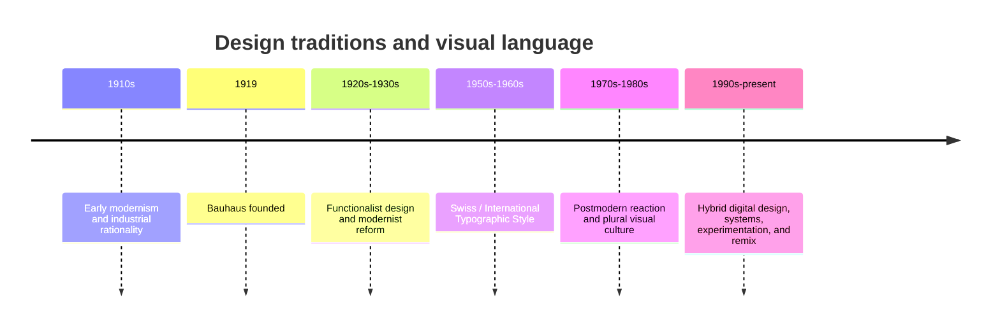

# Chapter 3 — Modernism, Postmodernism, and Visual Language

## Why design is a language

Visual design is not just decoration. It is a system of choices about hierarchy, rhythm, tone, and meaning. A page, a poster, a product interface, or a label all speak to us before we read a single word. They tell us what matters most, what feels trustworthy, what feels playful, and what feels serious.

Design is a form of language because it organizes attention. It decides what the eye sees first, what is secondary, and what is implied by contrast, spacing, typography, alignment, and visual repetition. In this sense, design never stays neutral. Even a plain white T-shirt can feel radically different depending on how it is presented.

## A short path into modernism

Modernism emerged from a wider interest in clarity, structure, and rational problem-solving. In design, this meant a stronger focus on function, order, and system. Designers did not want to rely only on tradition or decoration; they wanted to create work that felt direct and intellectually coherent.

Several movements and institutions shaped this direction. The Bauhaus, founded in Germany in 1919, was especially influential. It brought together art, craft, and industrial production. Its designers believed that design should serve everyday life while still being intellectually serious. Form and function were connected, and visual clarity was treated as a democratic goal.

The Bauhaus also influenced the later Swiss or International Typographic Style, which became especially important in the mid-20th century. Swiss designers emphasized legibility, asymmetrical layouts, grid systems, and disciplined typography. They treated typography as a functional system rather than a decorative surface.

Modernist design often preferred:

- clear hierarchy
- consistent structure
- reduction of visual noise
- strong grids
- objective communication
- a belief that good design could be clear, efficient, and universal

## Modernist principles

The modernist tradition is often associated with a set of principles that are still influential today.

### Grid

The grid gives structure. It helps organize information into predictable patterns and allows complexity to feel legible. A grid is a system for alignment, rhythm, and proportion.

### Hierarchy

Hierarchy tells us what matters first. It can be created through scale, weight, spacing, contrast, and placement. Modernists used hierarchy to guide the eye and make information easier to scan.

### Clarity

Clarity means reducing ambiguity. A designer makes decisions that help the audience understand the message quickly. This can mean simplifying forms, emphasizing the essential, and removing unnecessary decoration.

### Reduction

Reduction is the idea that complexity is not always helpful. A strong design often strips away what is not needed. Modernists believed that clarity was improved by removing excess.

### Function

Function matters because products and interfaces are meant to do something. A poster, a label, or a website should help the audience understand the message and complete a task. Good form supports use.

These ideas shaped not only print design but also architecture, product design, and digital systems.

## The postmodern reaction

Postmodernism emerged partly as a reaction against modernist certainty. Where modernism often valued one clearly correct solution, postmodern design accepted pluralism, contradiction, and complexity.

A postmodern designer does not assume that one universal order is always the best answer. Instead, the work may express:

- plurality instead of one dominant system
- irony instead of solemn certainty
- disruption instead of perfect order
- quotation and remix instead of pure originality
- expressive typography instead of strict neutrality

This does not mean that postmodern design is simply “messy.” It often uses deliberate complexity. It may break the grid, distort the expected order, or layer references in ways that make the audience aware of history, style, and culture.

The tension is clear: modernists often aimed for order, while postmodernists valued disruption and self-awareness.

## Ongoing tensions in visual language

The argument between modernism and postmodernism continues in contemporary design, especially in digital products and brand systems.

- Order and disruption: some interfaces favor calm consistency, while others deliberately break rhythm to create energy.
- Universality and identity: some systems aim for broad accessibility; others foreground cultural specificity and personal expression.
- Clarity and expression: some designs prioritize efficiency; others prioritize mood, personality, and artistic intention.
- Grid and anti-grid: grids provide coherence, while anti-grid layouts create tension and surprise.
- Restraint and abundance: minimal design can feel confident and premium, while dense, layered design can feel immersive and expressive.
- Function and irony: products can be designed to work efficiently, but also to signal humor, cultural reference, or critical distance.

These tensions appear in websites, apps, branding systems, packaging, editorial design, and social media graphics. Contemporary design often mixes modernist discipline with postmodern play.

## How to Read a Design

When you look at a design, ask a few practical questions:

- What is the hierarchy? What does the eye see first?
- Is the layout orderly or deliberately unstable?
- What is the tone: serious, playful, authoritative, intimate, ironic?
- What relationship does the design have to history or tradition?
- Does the design seem to invite clarity, or does it invite interpretation and ambiguity?
- What is being emphasized, and what is being hidden?

Good design analysis is not about naming a single “correct” style. It is about noticing how choices of structure, type, color, spacing, and image create meaning.

## Museum Research

If you want to study design history in a grounded way, look for authentic examples in museum and institutional collections. Use search terms like:

- “Bauhaus poster collection”
- “Swiss graphic design museum collection”
- “modernist typography exhibition”
- “postmodern graphic design museum archive”
- “The Metropolitan Museum of Art design collection”
- “MoMA graphic design collection”
- “Cooper Hewitt design archive”
- “V&A graphic design collection”
- “Bauhaus archive design works”

Check the official museum or institutional website and verify the object, archive, or exhibition before using it in a project. Do not rely on copied screenshots or secondary summaries as if they were direct evidence.

## The white T-shirt, redesigned

A plain white T-shirt can look very different depending on the visual language around it.

A modernist presentation might emphasize strict alignment, a clear grid, bold but restrained typography, and a minimal palette. The shirt looks like an efficient, durable essential. It feels intentional, clean, and universal.

A postmodern presentation might break alignment, mix unexpected type styles, use visual quotation, layers, or playful contradiction. The same shirt may feel more conceptual, expressive, or culturally loaded. It becomes less “just a shirt” and more like a statement object or identity marker.

The physical product remains the same, but the visual language changes the meaning. That is the power of design systems: they do not merely package information; they shape interpretation.

## Comparison table

| Tradition | Core values | Typical visual traits | Design effect |
| --- | --- | --- | --- |
| Early modernism | Rationality, function, order | Strong structure, simple forms, efficient systems | Clear, direct, confident |
| Bauhaus | Integration of art and industry | Modular design, functional objects, disciplined composition | Practical, modern, socially engaged |
| Swiss / International Typographic Style | Clarity, objectivity, grid | Asymmetry, sans-serif type, precise hierarchy | Legible, disciplined, universal |
| Postmodernism | Plurality, irony, expression | Mixing styles, anti-grid layouts, expressive typography | Layered, provocative, self-aware |
| Contemporary digital design | Hybrid approaches | Balanced grids, motion, system thinking, visual experimentation | Flexible, adaptive, audience-aware |

## Historical timeline

## What You Should Remember

- Design is a language that shapes attention, meaning, and trust.
- Modernism emphasized clarity, structure, reduction, and function.
- Bauhaus and the Swiss / International Typographic Style pushed design toward systematic order and legibility.
- Postmodernism reacted against certainty by valuing plurality, irony, disruption, and self-reference.
- Contemporary design rarely chooses only one side of this tension; it mixes methods and values.
- A plain white T-shirt can feel like a universal basic or a self-aware cultural object depending on how it is presented.
- The key skill is not memorizing styles, but learning how to read the visual choices behind them.
