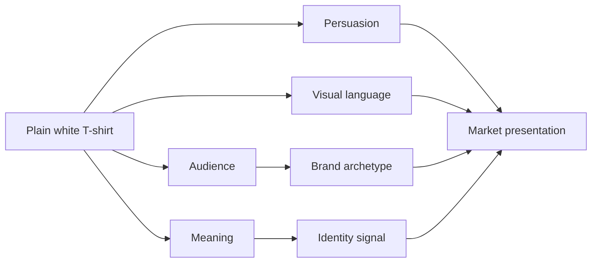

# Chapter 4 — The Plain White T-Shirt Case Study

## One shirt, many identities

A plain white T-shirt is the perfect product for studying persuasion, branding, and design language because it is almost intentionally blank. It has no obvious personality on its own. It is a neutral object, which means the brand has to supply the meaning.

This is where the earlier ideas come together. Persuasion decides how a product is framed. Archetypes decide what emotional role the brand wants the customer to step into. Visual language decides how that story feels in the eye. The shirt is the same, but the market story can be radically different.

That is the main lesson of this chapter: the product is not the whole story. The product is the anchor. The meaning, audience, and styling create the identity.

## Four versions of the same shirt

Below are four distinctly positioned presentations of one ordinary, high-quality plain white T-shirt.

### 1. The Explorer version: “The shirt for going”

- Target audience: students, travelers, freelance workers, people who like movement, discovery, and flexible routines
- Brand archetype: Explorer
- Persuasive principles: scarcity, social proof, identity signaling, narrative
- Visual language: earthy tones, rugged imagery, soft documentary photography, practical typography, low-contrast but confident layouts
- Headline: “Wear the shirt that keeps up with the plan.”
- Short product story: This is the T-shirt for people who treat every day like an itinerary that may change. It is simple, comfortable, and built to travel light. It says the user is capable, adaptable, and not tied to a single routine.
- Likely imagery: a person standing at a train platform, a jacket slung over one shoulder, a road map, or a sunrise scene with a small bag and a camera
- What meaning the customer is invited to buy: not just clothing, but independence, mobility, and the feeling of being unbothered by plans
- Ethical concern or limitation: the message risks glamorizing constant movement or productivity without acknowledging that not everyone has freedom or time to roam

This version sells a lifestyle of motion. It does not just sell cotton; it sells the feeling of being ready for the next departure.

### 2. The Swiss modernist version: “The clean essential”

- Target audience: design students, professionals, people who prefer order, clarity, and functional elegance
- Brand archetype: Sage or Ruler, depending on the emphasis
- Persuasive principles: authority, clarity, commitment and consistency, functional value
- Visual language: restrained modernist, Swiss-inspired grid, strong hierarchy, sans-serif typography, generous whitespace, controlled color palette
- Headline: “Essential. Precise. Built to last.”
- Short product story: The product is the plain white T-shirt reduced to its most honest form: high-quality fabric, disciplined construction, and exactly enough design to do its job well. The shirt is positioned as a reliable everyday object rather than a lifestyle accessory.
- Likely imagery: a close-up studio shot, a clean folded presentation, minimal product photography, quiet neutral background, no excessive styling
- What meaning the customer is invited to buy: precision, intelligence, taste, and the belief that simplicity is not boring but disciplined
- Ethical concern or limitation: this approach can feel elitist or overly perfectionist if it suggests that only the “disciplined” customer understands true quality

This version is the opposite of hype. It asks the customer to admire restraint. It works because it feels credible and mature.

### 3. The Rebel version: “Not another uniform”

- Target audience: young creatives, culture-minded consumers, people who dislike trend-chasing and generic branding
- Brand archetype: Rebel
- Persuasive principles: scarcity, social proof, identity signaling, disruption
- Visual language: rough edges, anti-grid layouts, bold typography, black-and-white contrast, sometimes deliberately imperfect image treatment or minimalist propaganda-like composition
- Headline: “Refuse the template.”
- Short product story: This is the shirt for people who do not want to look like a catalog page. It is intentionally simple but presented as a rejection of convenience culture. The product becomes a wearable expression of independence and taste.
- Likely imagery: distressed textures, high-contrast black-and-white photography, unconventional cropping, editorial layouts, images of people in motion, not polished studio perfection
- What meaning the customer is invited to buy: anti-conformity, authenticity, cultural awareness, and the feeling that the customer is not easily sold
- Ethical concern or limitation: the message can drift into performative rebellion or shallow anti-brand messaging if it mistakes attitude for substance

This version works because it turns a basic garment into an identity signal. The customer is not buying a shirt; they are buying the feeling of not belonging to the mainstream.

### 4. The Creator / Magician version: “A blank canvas for your next idea”

- Target audience: artists, designers, students, makers, people who enjoy custom expression
- Brand archetype: Creator or Magician
- Persuasive principles: liking, narrative, commitment and consistency, identity alignment
- Visual language: expressive, experimental, collage-heavy, layered typography, playful but intentional compositions, soft gradients or color accents that suggest possibility
- Headline: “Start with a blank shirt. Finish with your voice.”
- Short product story: The shirt is presented as an object that does not dictate the customer’s identity. Instead, it invites customization, remixing, and artistic expression. The brand frames the shirt as a base material for self-invention rather than a finished identity.
- Likely imagery: sketches, cut-and-paste layouts, torn paper textures, hand-drawn notes, or stylized studio scenes with tools, markers, fabric swatches, and creative mess
- What meaning the customer is invited to buy: possibility, authorship, creative agency, and the feeling that the shirt can become part of a personal story
- Ethical concern or limitation: this version can romanticize creativity while ignoring that not everyone has access to time, money, or space to make or customize their clothes

This version treats the product as a medium rather than a product. It turns a basic T-shirt into a platform for self-expression.

## Why these versions feel different even though the shirt is the same

The shirt remains materially similar in all four cases. What changes is:

- the emotional promise
- the target audience
- the visual treatment
- the cultural script attached to the item
- the persuasive logic behind the message

This is the central insight of the case study: persuasion does not create a new shirt; it creates a new interpretation of the shirt. Design language turns a blank object into a meaningful object. Archetype gives it a role in identity. Persuasion helps the audience imagine why they should care.

## Synthesis table

| Concept | Target audience | Archetype | Persuasive principles | Visual language | Main meaning offered |
| --- | --- | --- | --- | --- | --- |
| Explorer | Travelers, students, restless professionals | Explorer | Scarcity, social proof, identity signaling | Earthy, documentary, practical | Freedom and adaptability |
| Modernist essential | Design-conscious, organized consumers | Sage / Ruler | Authority, clarity, functional value | Swiss grid, minimal typography | Discipline, precision, trust |
| Rebel | Creative dissenters and anti-trend consumers | Rebel | Disruption, scarcity, identity signaling | Anti-grid, bold contrast, rough edges | Authenticity and refusal |
| Creator | Artists, makers, students, stylists | Creator / Magician | Narrative, liking, commitment, identity alignment | Expressive, layered, collage-like | Possibility and authorship |

## How the product becomes a market presentation

This diagram shows why the same physical object can support many different presentations. The shirt is only the starting point. The audience, narrative, persuasive tactics, and visual framing combine into a market story.

## Ethical questions in any position

Every version has a risk.

- The Explorer version may romanticize motion without considering actual constraints.
- The modernist version may imply superiority through restraint.
- The Rebel version may mistake attitude for insight.
- The Creator version may frame creativity as accessible even when it is not.

The ethical question is not whether a brand should persuade at all. It is whether the message honestly reflects the product and leaves room for the audience to decide with real information.

A strong brand does not need to lie to be memorable. It needs to be believable.

## What You Should Remember

- The same product can support radically different emotional meanings.
- Persuasion shapes the story, archetype shapes the identity, and visual language shapes the feeling.
- A plain white T-shirt becomes interesting when a brand gives it a clear role in someone’s life.
- The best presentations are not simply the loudest; they are the most coherent, honest, and aligned with the audience.
- Every brand promise carries an ethical tradeoff, so the real question is whether the story helps people choose or simply pressures them.

A good product presentation does not invent a new shirt. It makes the audience feel that the shirt already fits the life they want to live.
