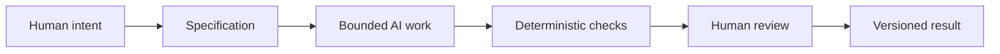

# Chapter 5 — Synthesis: Designing Meaning and Directing AI

## From product to process

The earlier chapters were about meaning. Persuasion asked: how do we shape attention, interpretation, trust, and action? Archetypes asked: what identity is this product or brand trying to express? Design language asked: how should that meaning look, feel, and behave?

This final chapter brings those ideas together and explains why they matter not only for branding and design, but also for working with AI.

A lot of AI work fails not because the model is weak, but because the task is underspecified. If a person says, “Make this better,” the model has to guess what “better” means. If a person gives a clearer task—“Create a one-page brochure for first-year students explaining persuasion; tone should be conversational, include a white T-shirt example, and use a plain-language approach”—the model has much more to work with.

That is the same logic as design: a strong brief gives the work direction.

## The three lenses as a control framework

A useful way to direct creative or technical work is to ask three questions:

- Persuasion: What response are we trying to enable?
- Archetype: What meaning or identity are we expressing?
- Design language: How should that meaning look, feel, and communicate?

These questions can be used far beyond marketing. They are helpful when creating:

- a landing page
- a class assignment
- a product spec
- a research note
- a draft of a chapter
- a visual system
- a prompt for an AI assistant

When used together, these lenses give you a framework for clarity. They help answer not just what the work is, but why it exists and how it should be experienced.

## Why specification matters

A specification is a bounded description of the task. It tells the AI assistant what the objective is, what constraints matter, what format is required, and what counts as success. Without a specification, the work may drift, become generic, or confuse style with substance.

Good specification has a few qualities:

- clear output requirements
- defined audience
- explicit tone or style constraints
- acceptable formats and file names
- success criteria or checks

This is not bureaucracy for its own sake. It is a way to reduce ambiguity. A task that is too open becomes harder to evaluate. A task with boundaries is easier to test, revise, and improve.

In design language, this is similar to setting a strong grid or hierarchy. In AI work, the specification acts like the system that prevents the output from becoming unreadable or directionless.

## Why version control matters

Version control matters because AI-generated work is often iterative, experimental, and changeable. A person may ask for three versions of a paragraph, three different directions for a design concept, or a rewrite that changes the tone. Without a versioning system, it becomes hard to tell what changed, what worked, and what should be discarded.

Git gives traceability and recovery. It records change over time. It allows a student or designer to:

- compare versions
- revert to an earlier state
- understand what changed in a specific iteration
- work on separate branches for ideas or experiments
- merge the best results into the final version

This matters even more when AI is involved because the model often produces fast, confident output that is not always correct. The version history becomes a safety net. It creates accountability and gives the human a way to review exactly what was created, when, and why.

## Deterministic checks and probabilistic review

Not all evaluation is the same.

Deterministic checks are automatic and rule-based. They can verify things like:

- file names exist
- a markdown file includes the required headings
- a Mermaid block is properly formatted
- a checklist item is present
- a script or command exits with success

These checks are cheap, repeatable, and dependable. Their value is that they remove uncertainty from mechanical tasks.

Probabilistic review is different. This is where AI or human judgment looks at quality, tone, elegance, appropriateness, or strategic fit. It is useful because some questions cannot be reduced to simple rules. For example:

- Does this chapter sound intelligent and readable?
- Is the tone appropriate for first-year students?
- Is the message persuasive without becoming manipulative?
- Does the design feel coherent?

This kind of review is powerful, but not perfectly reliable. AI review can catch patterns, suggest improvements, or help compare options. But it is still probabilistic: it may be right often, but not always. That is why human judgment remains essential.

## The race-car pit-stop metaphor

Think of the work process like a race-car pit stop.

Automation can keep the car running and move quickly through routine tasks: a tire change, a fluid check, a system scan, a timing check, a file validation. But some moments require a deliberate human inspection: a decision about strategy, a judgment about risk, a decision to continue or stop, a choice about whether the work still aligns with the intended meaning.

In the same way, AI can speed up drafting, checking, and iteration. But the moments that matter most deserve human attention. The human is still responsible for the meaning, the ethics, the context, and the final judgment.

## Human judgment is still the final decision-maker

AI can generate, suggest, and organize, but it does not own responsibility for the outcome. Humans remain responsible for:

- judgment
- truthfulness
- context
- ethics
- audience awareness
- final decision-making

This is especially important when the task involves persuasion or design. A persuasive message can be effective without being honest. A strong visual system can be beautiful but misleading. A vague AI output can sound confident while missing the real objective.

The human must decide whether the work is aligned with the true purpose. That means checking not only whether the output is attractive, but whether it is accurate, appropriate, and ethically grounded.

## The full workflow

This diagram shows the basic workflow for responsible AI-assisted work. Human intent begins the process, but the system is constrained and verified. The AI does useful work inside a clear scope, while automation checks for mechanical correctness and humans inspect the strategic and ethical quality of the result.

## How the three lenses guide AI

The lens framework works well when prompting or reviewing AI output:

- Persuasion helps define the intended response.
- Archetype clarifies the identity or emotional role of the work.
- Design language gives the output its visual and communicative form.

If a student is asking AI to produce a chapter, a landing page, or a product concept, they should first be clear about these questions:

- What should the audience feel or do?
- What story or identity are we expressing?
- What visual style supports that meaning?

This prevents the AI from wandering into generic “professional-looking” output that does not actually fit the purpose.

## Questions for Next Week

- What happens when the audience and the brand identity do not match?
- Where do you draw the line between persuasive clarity and manipulation?
- How much of a design decision should be left to AI versus human review?
- When does a good specification become too rigid?
- How would you use the three lenses to improve a real assignment or design problem?

## What You Should Remember

- Persuasion, archetype, and visual language are three connected ways of understanding meaning.
- AI work improves when it is bounded by a clear specification.
- Git provides traceability, recovery, and a disciplined way to manage iteration.
- Deterministic checks are useful for mechanical validation; AI review is useful but probabilistic.
- Human judgment remains essential for meaning, ethics, truth, context, and final responsibility.
- Good design and good AI use are not about removing human decisions. They are about making those decisions more informed, more structured, and more accountable.

The point is not to replace judgment with automation. The point is to build a system in which the machine does what it is good at, while the human stays responsible for what matters most.
